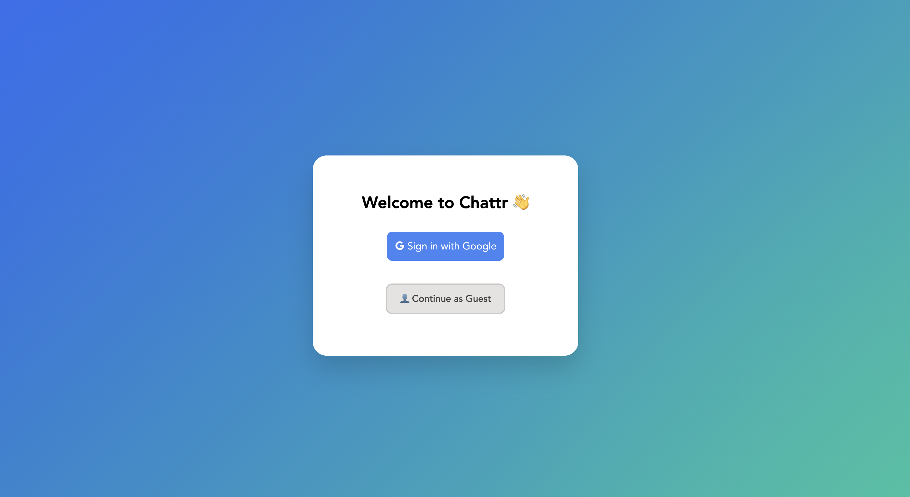
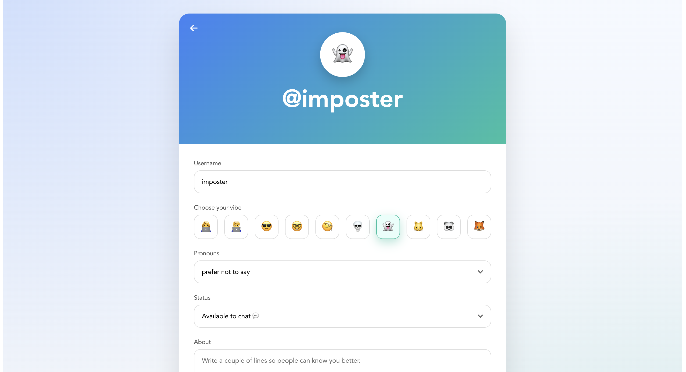
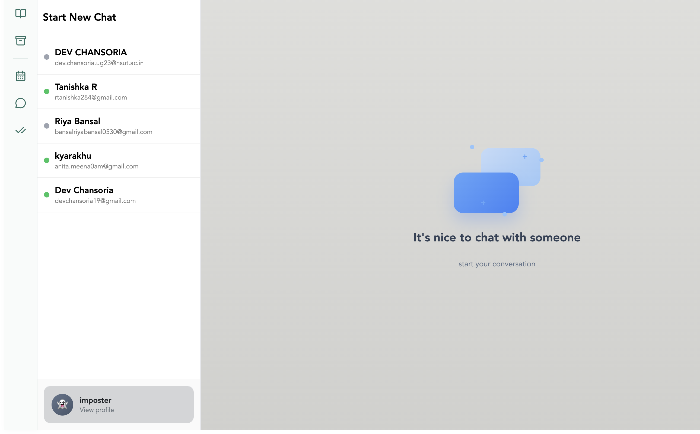
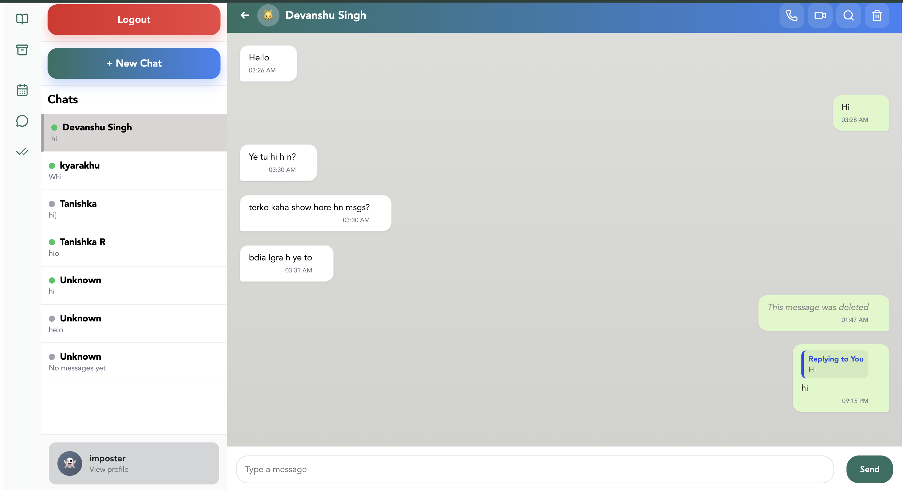
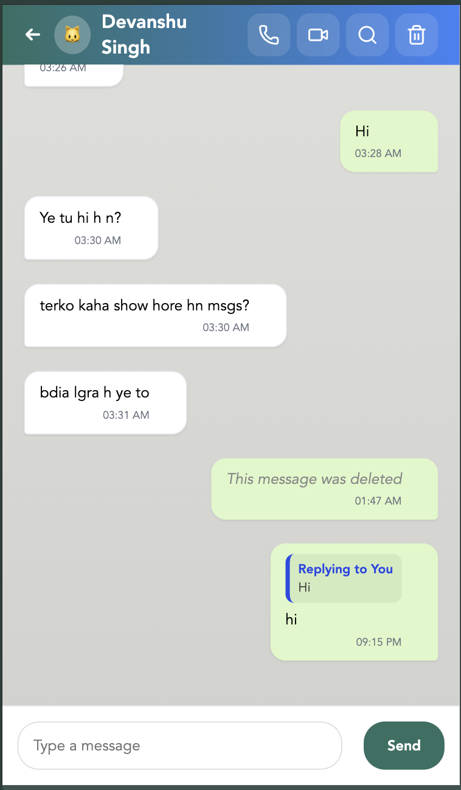

# Messaging Platform 💬
 [Messaging Platform 💬](https://messaging-platform123.netlify.app) 

[](https://react.dev/)
[](https://firebase.google.com/)
[](https://developer.mozilla.org/docs/Web/JavaScript)
[](https://vitejs.dev/)
[](https://firebase.google.com/products/firestore)

A modern, responsive real-time messaging platform built with React and Firebase. Users can securely sign in, discover contacts, manage profiles, and exchange messages with live chat, presence, and unread-message updates.

This project builds on an existing chat-application foundation and extends it with substantial functionality, Firebase integration, user-experience improvements, bug fixes, and assignment-focused enhancements.

## ✨ Features

- 🔐 Google Authentication with Firebase Auth and guest login
- ⚡ Real-time one-to-one messaging with Cloud Firestore
- 👤 View and edit user profiles
- 🟢 Online/offline presence and real-time chat updates
- 🆕 Persisted unread (`NEW`) message indicator
- ↩️ Reply to messages and delete messages
- 💬 Chat list with latest-message previews
- 🔎 Search users and chats
- 📱 Responsive, mobile-friendly interface
- 🎨 Clean modern UI with Lucide icons
- 🚧 Reachable “Coming Soon” dialogs for Stories, Archived Chats, Voice Calling, Video Calling, Scheduled Messages, Message Search, Pinned Messages, and Message Reactions

## 🧰 Tech Stack

- React.js + JavaScript
- Vite
- Firebase Authentication
- Cloud Firestore
- CSS
- Lucide React

## 🔥 Firebase Services Used

| Service | Purpose |
| --- | --- |
| Firebase Authentication | Google sign-in and account sessions |
| Cloud Firestore | Users, chats, messages, presence, and read receipts |

## 📁 Project Structure

```text
src/
├── components/       # Chat, profile, auth, and UI components
├── contexts/         # Authentication context
├── utilities/        # Shared utility functions
├── App.jsx           # Application routes
└── main.jsx          # Entry point
```

## 🚀 Installation

```bash
git clone https://github.com/Tanishka270/messaging-platform.git
cd messaging-platform
npm install
npm run dev
```

## 🔑 Environment Variables

Create a `.env` file in the project root:

```env
VITE_FIREBASE_API_KEY=
VITE_FIREBASE_AUTH_DOMAIN=
VITE_FIREBASE_PROJECT_ID=
VITE_FIREBASE_STORAGE_BUCKET=
VITE_FIREBASE_MESSAGING_SENDER_ID=
VITE_FIREBASE_APP_ID=
```

Add your Firebase web-app credentials and keep `.env` out of version control.

## 🛡️ Firestore Security Rules

Use Firebase Authentication in your Firestore rules so only signed-in users can access data, and restrict chat reads/writes to each chat’s members. Validate `readBy` updates so users can only add their own UID.

## 📸 Screenshots

### 🔐 Login Screen


### 👤 Profile Screen


### 💬 Chat Window



### 📱 Mobile View



## 🌱 Future Enhancements

- Production implementations for calling, stories, archived chats, scheduling, search, pins, and reactions
- Media/file sharing and richer notifications
- Multi-device sync, backup/restore, and stronger privacy controls

## 👩‍💻 Author

**Tanishka**  
[GitHub](https://github.com/Tanishka270)
